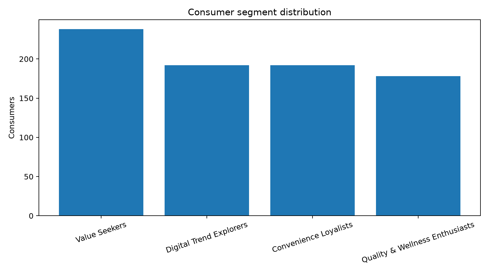
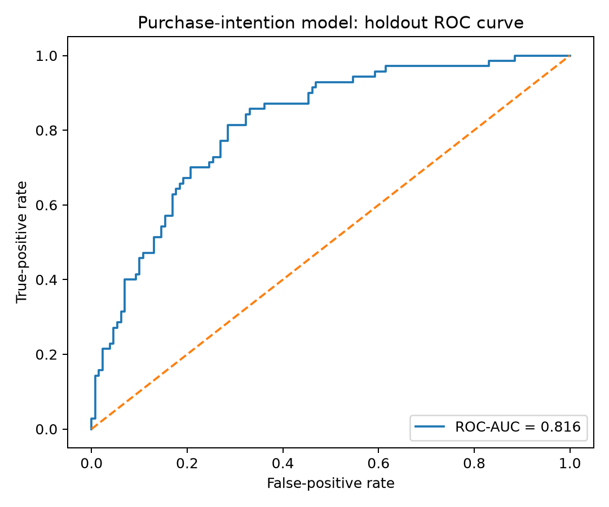

# FMCG Customer Insights: Consumer Segmentation and Purchase Drivers


[](LICENSE)

An end-to-end customer-insights portfolio project that translates synthetic FMCG consumer-survey data into **actionable segments, purchase-intention drivers, channel insights, and business recommendations**.

**Author:** Mohammad Maliki Rafli  
**Program:** Master of Public Health — Biostatistics and Health Data Science, Universitas Airlangga

## Project Overview

FMCG teams need to understand not only **who buys**, but also **why consumers choose, trust, switch, and try products**. This case study demonstrates how consumer-research data can be transformed into decision-ready evidence for brand strategy, innovation, communication, channel planning, and market execution.

The project addresses three business questions:

1. Which consumer groups differ meaningfully in motivations and shopping behaviour?
2. Which factors are associated with willingness to try a new FMCG product?
3. How should product, message, promotion, and channel strategies differ across segments?

## Portfolio Presentation

The current portfolio deck contains **11 pages** covering the executive summary, analytical workflow, cluster validation, consumer personas, channel behaviour, purchase-intention drivers, strategic recommendations, limitations, and reproducibility.

- `05_Presentation/FMCG_Customer_Insights_Portfolio_Presentation.pdf` — latest designed portfolio presentation
- [Read the analytical report source](01_Report/FMCG_Customer_Insights_Report.md)
- [Open the executed analysis notebook](02_Script/FMCG_Customer_Insights_Analysis.ipynb)

## Repository Structure

```text
.
├── 01_Report/
│   ├── FMCG_Customer_Insights_Report.md
│   └── FMCG_Customer_Insights_Report.pdf
├── 02_Script/
│   ├── 01_Generate_Synthetic_Data.py
│   ├── 02_FMCG_Customer_Insights_Analysis.py
│   ├── 03_Build_Analysis_Notebook.py
│   ├── 04_Build_Portfolio_PDFs.py
│   └── FMCG_Customer_Insights_Analysis.ipynb
├── 03_Data/
│   ├── README.md
│   ├── data_dictionary.csv
│   ├── raw/
│   └── processed/
├── 04_Output/
│   ├── figures/
│   └── tables/
├── 05_Presentation/
│   └── FMCG_Customer_Insights_Portfolio_Presentation.pdf
├── 06_Dashboard/
│   └── app.py
├── .github/workflows/
│   └── reproduce-analysis.yml
├── LICENSE
├── README.md
└── requirements.txt
```

## Analytical Workflow

1. Generate a reproducible synthetic survey of 800 FMCG consumers.
2. Construct eight multi-item consumer scales and assess internal consistency.
3. Standardise segmentation variables and compare K-means solutions.
4. Select and profile four interpretable consumer segments.
5. Analyse segment differences in attitudes, spending, purchase frequency, and channels.
6. Fit an interpretable logistic-regression model for high new-product intention.
7. Evaluate model discrimination on a stratified holdout sample.
8. Translate statistical findings into segment-specific business recommendations.

## Methods

### Consumer measurement

- Three Likert items for each consumer construct
- Explicit missing-value handling
- Mean-scale scoring
- Cronbach's alpha for internal consistency

### Consumer segmentation

- Standardisation of attitudinal variables
- K-means clustering with repeated initialisation
- Silhouette diagnostics for two to six clusters
- Business naming from dominant cluster characteristics

### Purchase-intention modelling

- Logistic regression with standardised numeric predictors
- One-hot encoding for categorical predictors
- Stratified development–holdout split
- ROC-AUC, accuracy, classification report, and confusion matrix

## Key Results

| Metric | Result |
|---|---:|
| Synthetic consumer profiles | **800** |
| Actionable consumer segments | **4** |
| Four-cluster silhouette score | **0.202** |
| Purchase-intention ROC-AUC | **0.813** |
| High new-product intention | **35.0%** |
| Median monthly FMCG spend | **IDR 0.97M** |

| Segment | Share | Primary opportunity |
|---|---:|---|
| **Value Seekers** | **29.9%** | Pack-price architecture, bundles, and visible value cues |
| **Digital Trend Explorers** | **25.4%** | Creator seeding, social commerce, reviews, and launch trials |
| **Convenience Loyalists** | **23.4%** | Availability, trusted performance, and frictionless repurchase |
| **Quality & Wellness Enthusiasts** | **21.4%** | Evidence-led benefits, premium innovation, and wellness positioning |

## Selected Visualisations

The README uses **PNG assets** because GitHub renders them more consistently than generated SVG files.

### Consumer segment distribution



### Segment profile heatmap


### Primary shopping channel by segment


### Purchase-intention drivers


### Holdout ROC curve



## Business Recommendations

- **Innovation launch:** prioritise Digital Trend Explorers for digital discovery, product trial, reviews, and advocacy.
- **Premium growth:** target Quality & Wellness Enthusiasts with credible functional benefits and evidence-led communication.
- **Retention:** protect Convenience Loyalists through dependable availability and simplified repeat purchase.
- **Value architecture:** use bundles, price ladders, and targeted promotions for Value Seekers.
- **Measurement:** track segment-level trial, repeat purchase, conversion, retention, and incremental uplift.

## Data Integrity

The dataset is **fully synthetic and reproducibly generated**. It contains no real respondents, confidential company information, or proprietary market data. The project demonstrates analytical capability and should not be interpreted as an estimate of the Indonesian FMCG market.

## Reproducing the Analysis

```bash
git clone https://github.com/mohmalikirafli/fmcg-customer-insights-segmentation.git
cd fmcg-customer-insights-segmentation
python -m venv .venv
pip install -r requirements.txt
python 02_Script/01_Generate_Synthetic_Data.py
python 02_Script/02_FMCG_Customer_Insights_Analysis.py
python 02_Script/03_Build_Analysis_Notebook.py
```

Run the dashboard locally:

```bash
streamlit run 06_Dashboard/app.py
```

## Limitations

- The dataset is synthetic and cannot estimate real prevalence, market size, or causal effects.
- The consumer segments are analytical summaries that require validation using observed market data.
- The silhouette score indicates moderate rather than strong geometric separation.
- The logistic-regression coefficients indicate adjusted associations, not causal effects.
- Commercial recommendations are hypotheses for testing, not direct market instructions.

## Conclusion

This portfolio demonstrates how biostatistics, survey analysis, machine learning, and evidence communication can be transferred to Customer Market Insights. It converts consumer data into differentiated and measurable actions for innovation, premium growth, retention, value strategy, and channel execution.

## License and Portfolio Use

The source code is available under the [MIT License](LICENSE). The report, presentation, figures, and written interpretation remain the intellectual work of the author and should be attributed when adapted or referenced.

This independent portfolio project is not affiliated with or endorsed by Unilever or any other FMCG company.

## Contact

For discussion or collaboration, contact **Mohammad Maliki Rafli** through the [GitHub profile](https://github.com/mohmalikirafli) or open an [issue](https://github.com/mohmalikirafli/fmcg-customer-insights-segmentation/issues).
