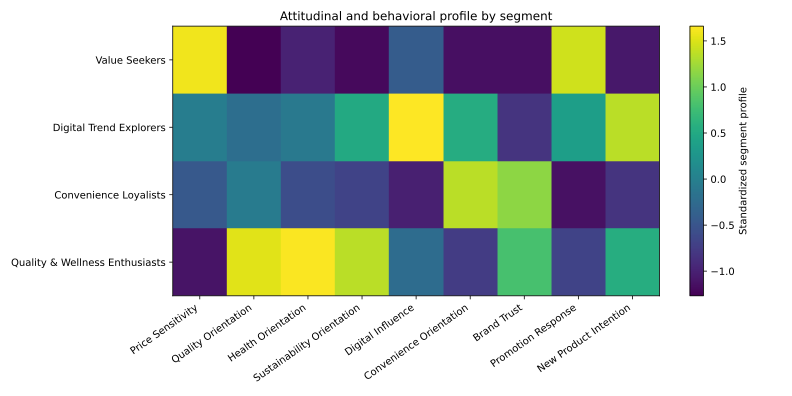
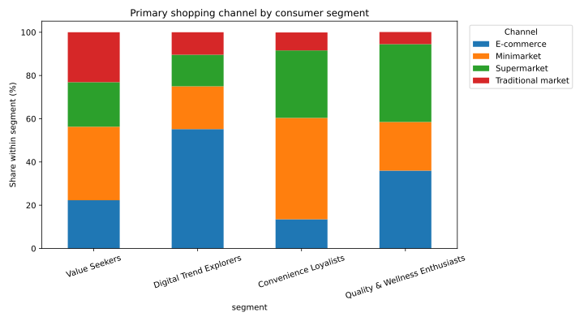
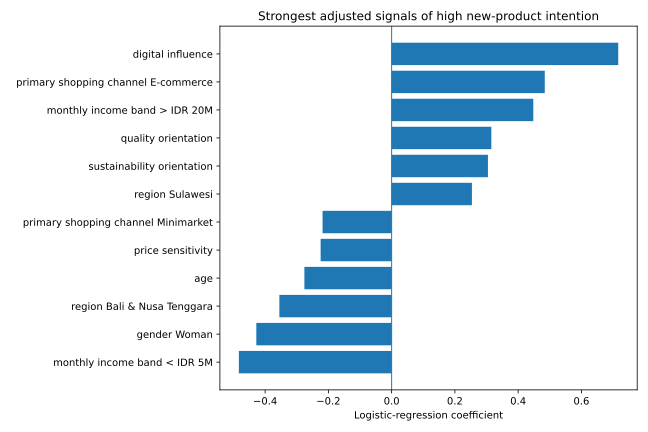
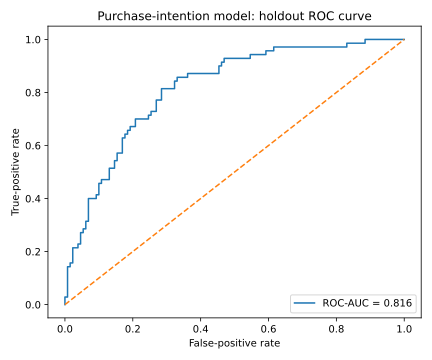

# FMCG Customer Insights: Consumer Segmentation and Purchase Drivers


[](LICENSE)

An end-to-end customer-insights portfolio project that translates synthetic FMCG consumer survey data into **actionable segments, purchase-intention drivers, channel insights, and business recommendations**. The workflow combines survey-scale assessment, K-means clustering, interpretable logistic regression, visualization, and an interactive dashboard.

**Author:** Mohammad Maliki Rafli  
**Program:** Master of Public Health - Biostatistics and Health Data Science, Universitas Airlangga

## Table of Contents

- [Project Overview](#project-overview)
- [Project Presentation](#project-presentation)
- [Business Objective](#business-objective)
- [Repository Structure](#repository-structure)
- [Analytical Workflow](#analytical-workflow)
- [Methods and Evaluation](#methods-and-evaluation)
- [Key Results](#key-results)
- [Selected Visualizations](#selected-visualizations)
- [Data Integrity](#data-integrity)
- [Reproducing the Analysis](#reproducing-the-analysis)
- [Interactive Dashboard](#interactive-dashboard)
- [Limitations](#limitations)
- [Conclusion](#conclusion)
- [Recommendations](#recommendations)
- [License and Portfolio Use](#license-and-portfolio-use)
- [Contact](#contact)

## Project Overview

FMCG teams need to understand not only **who buys**, but also **why consumers choose, trust, switch, and try products**. This case study demonstrates how consumer-research data can be transformed into decision-ready evidence for brand strategy, innovation, communication, channel planning, and in-market execution.

The project focuses on three business questions:

1. Which consumer groups differ meaningfully in motivations and shopping behavior?
2. Which factors are associated with willingness to try a new FMCG product?
3. How should product, message, promotion, and channel strategies differ across segments?

The repository contains a reproducible synthetic-data generator, an executed Jupyter notebook, modular Python scripts, aggregate results, publication-ready figures, a concise report, an executive presentation, and a Streamlit dashboard.

## Project Presentation

- [View the executive presentation PDF](05_Presentation/FMCG_Customer_Insights_Executive_Summary.pdf)
- [Read the presentation source](05_Presentation/FMCG_Customer_Insights_Executive_Summary.md)
- [Read the analytical report PDF](01_Report/FMCG_Customer_Insights_Report.pdf)
- [Read the report source](01_Report/FMCG_Customer_Insights_Report.md)
- [Open the executed analysis notebook](02_Script/FMCG_Customer_Insights_Analysis.ipynb)

## Business Objective

To identify actionable FMCG consumer segments, profile their motivations and channel behavior, and build an interpretable model of high new-product intention that can inform targeting, innovation launches, value architecture, and retention strategy.

## Repository Structure

```text
.
├── 01_Report/
│   ├── FMCG_Customer_Insights_Report.md
│   └── FMCG_Customer_Insights_Report.pdf
├── 02_Script/
│   ├── 01_Generate_Synthetic_Data.py
│   ├── 02_FMCG_Customer_Insights_Analysis.py
│   ├── 03_Build_Analysis_Notebook.py
│   ├── 04_Build_Portfolio_PDFs.py
│   └── FMCG_Customer_Insights_Analysis.ipynb
├── 03_Data/
│   ├── README.md
│   ├── data_dictionary.csv
│   ├── raw/
│   │   └── fmcg_consumer_survey_synthetic.csv
│   └── processed/
│       └── fmcg_consumer_scored.csv
├── 04_Output/
│   ├── figures/
│   │   └── *.png / *.svg
│   └── tables/
│       └── *.csv / *.json
├── 05_Presentation/
│   ├── FMCG_Customer_Insights_Executive_Summary.md
│   └── FMCG_Customer_Insights_Executive_Summary.pdf
├── 06_Dashboard/
│   └── app.py
├── .github/workflows/
│   └── reproduce-analysis.yml
├── .gitignore
├── LICENSE
├── README.md
└── requirements.txt
```

## Analytical Workflow

1. Generate a reproducible synthetic survey of 800 FMCG consumers.
2. Introduce limited missingness to demonstrate explicit preprocessing.
3. Construct eight multi-item consumer scales and assess reliability.
4. Standardize segmentation variables and compare K-means solutions.
5. Select a four-cluster solution and translate clusters into business personas.
6. Profile segment size, attitudes, spending, frequency, channel, and category behavior.
7. Define high new-product intention and fit an interpretable logistic-regression model.
8. Evaluate the model on a stratified holdout sample using ROC-AUC and classification metrics.
9. Convert findings into segment-specific recommendations for innovation, premium growth, retention, and value strategy.

## Methods and Evaluation

### Consumer measurement

- Eight constructs measured using three Likert-scale items each
- Median imputation for limited item-level missingness
- Mean-scale scoring
- Cronbach's alpha for internal consistency

### Segmentation

- Standardization of attitudinal and promotional-response variables
- K-means clustering with repeated initialization
- Silhouette diagnostics for two to six clusters
- Business naming based on dominant standardized cluster characteristics

### Purchase-intention model

- Logistic regression with standardized numeric predictors
- One-hot encoding for categorical predictors
- Stratified 75:25 development-holdout split
- ROC-AUC, accuracy, classification report, and confusion matrix
- Coefficient-based interpretation of adjusted signals

## Key Results

### Portfolio-level metrics

| Metric | Result |
|---|---:|
| Synthetic consumer profiles | **800** |
| Actionable segments | **4** |
| Cronbach's alpha range | **0.845-0.910** |
| Four-segment silhouette score | **0.242** |
| Holdout purchase-intention ROC-AUC | **0.849** |
| Holdout accuracy | **0.795** |
| High new-product intention | **39.2%** |
| Median monthly FMCG spend | **IDR 930,000** |

### Consumer segments

| Segment | Share | Core characteristics | Business implication |
|---|---:|---|---|
| **Value Seekers** | 29.9% | Highest price sensitivity and promotion response; lowest average spend | Use pack-price architecture, bundles, and visible value cues |
| **Convenience Loyalists** | 24.8% | Highest convenience orientation and brand trust; minimarket-led | Protect availability, trusted performance, and repeat-purchase ease |
| **Digital Trend Explorers** | 22.9% | Highest digital influence and new-product intention; e-commerce-led | Prioritize social discovery, reviews, creator seeding, and launch trials |
| **Quality & Wellness Enthusiasts** | 22.5% | Highest quality, health, sustainability, and average spend | Lead with credible benefits, evidence-led communication, and premium innovation |

### Channel evidence

- **55.7%** of Digital Trend Explorers primarily shop through e-commerce.
- **49.0%** of Convenience Loyalists primarily use minimarkets.
- Quality & Wellness Enthusiasts are split mainly between e-commerce and supermarkets.
- Value Seekers show the strongest traditional-market presence and remain highly promotion responsive.

### Purchase-intention signals

The interpretable holdout model achieved **ROC-AUC 0.849**. In this synthetic case study, stronger positive adjusted signals included digital influence, health orientation, e-commerce shopping, and purchase frequency. Price sensitivity and older age showed negative associations with high new-product intention. These coefficients describe model associations and must not be interpreted causally.

## Selected Visualizations

### Consumer segment distribution


### Segment profile heatmap



### Primary shopping channel by segment



### Purchase-intention drivers



### Holdout ROC curve



## Data Integrity

The consumer dataset is **fully synthetic and reproducibly generated**. It contains no real respondents, confidential company information, or proprietary market data. The project demonstrates analytical reasoning, reproducibility, interpretation, and data storytelling; it does not provide a factual estimate of the Indonesian FMCG market.

The raw synthetic data, processed data, generation logic, and data dictionary are all included so that reviewers can audit the complete workflow.

## Reproducing the Analysis

1. Clone the repository:

   ```bash
   git clone https://github.com/mohmalikirafli/fmcg-customer-insights-segmentation.git
   cd fmcg-customer-insights-segmentation
   ```

2. Create and activate a virtual environment.

3. Install the required packages:

   ```bash
   pip install -r requirements.txt
   ```

4. Generate the synthetic data:

   ```bash
   python 02_Script/01_Generate_Synthetic_Data.py
   ```

5. Run the complete analysis:

   ```bash
   python 02_Script/02_FMCG_Customer_Insights_Analysis.py
   ```

6. Rebuild and execute the notebook when required:

   ```bash
   python 02_Script/03_Build_Analysis_Notebook.py
   jupyter nbconvert --to notebook --execute --inplace 02_Script/FMCG_Customer_Insights_Analysis.ipynb
   ```

## Interactive Dashboard

Run the dashboard locally after generating the processed dataset:

```bash
streamlit run 06_Dashboard/app.py
```

The dashboard supports segment filtering and displays segment size, spending, purchase frequency, channel mix, and attitudinal profiles.

## Limitations

- All records are synthetic and do not represent actual Indonesian FMCG consumers.
- The selected four-cluster solution is partly driven by the simulation design and business interpretability.
- The silhouette score indicates moderate rather than strong geometric separation.
- Model performance is based on a single internal holdout split.
- Logistic-regression coefficients indicate adjusted associations, not causal effects.
- Recommendations require validation using real survey, panel, transaction, retail-audit, or social-listening data.

## Conclusion

The project identifies four interpretable consumer segments and demonstrates how survey attitudes, shopping behavior, and channel preferences can be combined into decision-ready customer insights. Digital Trend Explorers provide the strongest launch and advocacy opportunity, Quality & Wellness Enthusiasts support premium growth, Convenience Loyalists offer a retention opportunity, and Value Seekers require disciplined value architecture.

## Recommendations

- Validate the segment framework using observed consumer data.
- Apply sampling weights when using a population-based survey.
- Test segment stability through repeated clustering and external validation.
- Evaluate incremental campaign lift rather than relying only on model discrimination.
- Track segment-level trial, conversion, repeat purchase, availability, and promotional profitability.
- Use qualitative research to explain the motivations behind quantitative patterns.

## License and Portfolio Use

The source code is available under the [MIT License](LICENSE). The report, figures, presentation, and written interpretation remain the intellectual work of the author and should be attributed when adapted or referenced.

This repository is intended for education, portfolio demonstration, and methodological discussion. It is not affiliated with or endorsed by Unilever or any other FMCG company.

## Contact

For questions, collaboration, or discussion, contact **Mohammad Maliki Rafli** through the [GitHub profile](https://github.com/mohmalikirafli) or open an [issue](https://github.com/mohmalikirafli/fmcg-customer-insights-segmentation/issues).

---

This repository demonstrates the transfer of biostatistics, survey analysis, and health data science skills into Customer Market Insights.